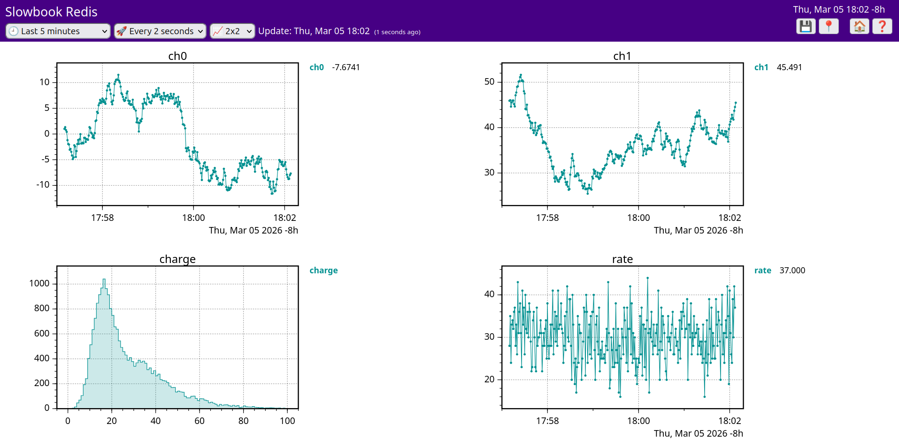

## Example: Storing Slowbook Data in Redis

### Contents
- **01-numeric.cpp**: Stores time-series data in Redis TimeSeries
- **02-histogram.cpp**: Stores histograms in the Redis key-value store (overwrite mode: latest value only)
- **03-hist-ratetrend.cpp**: Adds a rate trend to the example above
- **slowdash.d**: Example SlowDash configuration for viewing the stored data

### Requirements
- C++17
- A Redis Stack server is running (Redis TimeSeries is required)
- The hiredis library is installed

If Redis is not installed, you can quickly start a temporary Redis Stack server with Docker:
```bash
docker run -p 6379:6379 redis/redis-stack-server:latest
```
Even if you already have Redis running, you can start another instance on a different port and use it for testing, so your existing Redis data remains untouched.
In that case, update the port number in the source code to point to the test instance.

### Setup
```bash
cd slowbook/examples/Redis
make
```

Slowbook itself is header-only, so it does not need to be compiled.

### Usage
**The following examples write data to database 1 on your Redis instance.**
If you do not want to affect existing Redis data, run a separate Redis instance (for example, with Docker) and update the port number accordingly.

Open three terminals and run the following commands:
##### Generate and store time-series data
```
./01-numeric
```

##### Generate event data, then build and store histograms and rate trends
```
./03-hist-ratetrend
```

##### View data in SlowDash
```
cd slowdash.d
slowdash --port=18881
```

Open `http://localhost:18881` in your web browser, then load the preconfigured layout `test`.




### Notes
To use Redis with Slowbook, you need two things:
- Link the Redis client library (`hiredis`) in your build settings (Makefile/CMake)
- Select Redis as the destination datastore in your C++ code


#### Makefile / CMakeLists.txt
Configure your build to link `hiredis` in the usual way.

For a Makefile, add the `hiredis` include and library flags to `CXXFLAGS` and `LIBS`:
```Makefile
CXXFLAGS+=$(shell pkg-config --cflags hiredis)
LIBS+=$(shell pkg-config --libs hiredis)
```

### C++ code
The full source of `01-numeric.cpp` is shown below.
To use Redis, only these two changes are required:
- Include the Slowbook Redis header: `#include <slowbook/datastore_Redis.hpp>`
- Select Redis as the datastore: `slowbook::DataStore_Redis ds("redis://localhost:6379/1");`

```c++

#include <iostream>
#include <unistd.h>
#include <slowbook.hpp>
#include <slowbook/datastore_Redis.hpp>

namespace sb = slowbook;


int main(void)
{
    sb::RandomWalk ch0, ch1;
    
    sb::DataStore_Redis ds("redis://localhost:6379/1");
    sb::SimpleNumericSchema schema("NumericData");
    
    while (true) {
        long t = time(NULL);
        double x0 = ch0.get();
        double x1 = ch1.get();

        ds.append(sb::SlowDashDataFrame(schema).tag("ch0").time(t) << x0);
        ds.append(sb::SlowDashDataFrame(schema).tag("ch1").time(t) << x1);

        std::cout << t << "  " << x0 << "  " << x1 << std::endl;
        sleep(1);
    }
    
    return 0;
}
```

- Using `DataStore::append()` stores data as time-series entries in Redis TimeSeries.
- Using `DataStore::update()` stores only the latest value in the Redis key-value store. In this case, timestamp information is not stored.

[TODO]: Currently, `append()` is not available for non-numeric data such as histograms. This is straightforward to implement and will be added soon.
